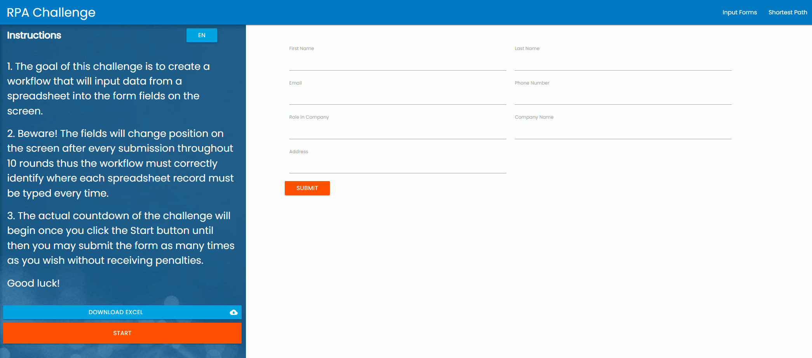

# 🤖 Projeto: RPA Challenge

Este projeto é um robô UiPath de **Automação Web** criado para o **Workshop de Automação de Processos com UiPath** (ministrado em 15/11/2025 para a turma de ADS da Faculdade Unis São Lourenço).

O objetivo é demonstrar a velocidade, a leitura de dados de um Excel e, o mais importante, a **resiliência de seletores** de UI.

## 🎯 O Desafio

O robô deve ler uma lista de 10 funcionários de uma planilha Excel e cadastrá-los no site [rpachallenge.com](http://rpachallenge.com/).

O "pulo do gato" deste site é que, a cada envio, **ele muda os campos de lugar** (ex: o campo "Email" pode aparecer no topo ou no final). Um robô baseado em seletores estáticos (como "clique na terceira caixa de texto") falharia miseravelmente.

## 💡 Conceitos Demonstrados

* **Automação de Navegador (Web):** Interagir com um site (`Use Application/Browser`).
* **Leitura de Dados (Excel):** Ler dados de uma planilha (`Read Range`).
* **Looping (Data-Driven):** Executar um conjunto de ações para cada linha da tabela de dados (`For Each Row in DataTable`).
* **Seletores Resilientes:** Usar a técnica de **Âncoras** (Modern Design) para encontrar um campo de texto (ex: a caixa) com base no seu rótulo (ex: o texto "Email"). Isso garante que o robô funcione, não importa a ordem dos campos.
* **Digitação e Cliques:** Inserir dados (`Type Into`) e submeter formulários (`Click`).

## ⚙️ Pré-requisitos para Executar

1.  **UiPath Studio** (Community Edition).
2.  **Extensão UiPath para Navegador** (Chrome ou Edge) instalada e ativada.
3.  O arquivo `challenge.xlsx` (disponível em www.rpachallenge.com).

## 🚀 Como Executar

1.  Clone ou baixe este repositório.
2.  Abra o arquivo `Main.xaml` no UiPath Studio.
3.  Garanta que possua o arquivo `challenge.xlsx`.
4.  Pressione **F5** (ou clique em **Run**).
5.  Assista ao robô preencher os 10 formulários em alta velocidade!